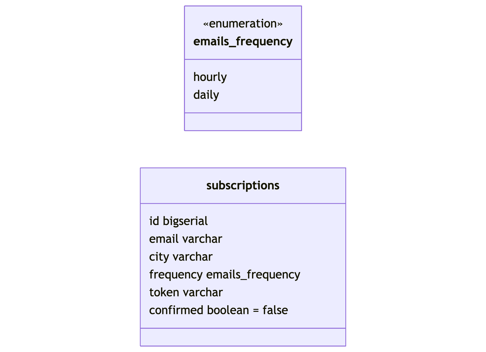

# ADR 001: Database consideration regarding subscriptions savings

**State**: Accepted.

**Date**: 2025-06-09.

**Author**: Oleksandr Prokhorov.

## Context

It is necessary to chose database for:
- Saving info about user and their's subscriptions.
- Notifications settings (frequency, target city).
- Confirmations and subscriptions history.

Database should:
- Have constraints (unique etc.).
- Be able to use indexes for fast search.
- Have an ability to auto generate IDs.

## Considered Options

### PostgreSQL
**Pros:**
- ACID and Transactions.
- Relational (suitable for structured data).
- Allows setting up indexes for specified fields.
- Caches frequent queries.
- Flexible setup and settings.

**Cons:**
- Requires more resources in comparison to other solutions.
- Overhead for simple tasks.
- Complicated to configure.

### MongoDB
**Pros:**
- Good for saving unstructured data.
- Simple to use and user friendly.
- Good for prototyping (when schema is not known yet).
- Simple JSON interactions.

**Cons:**
- Can be too clumsy with complex transactions.
- Fluid schema.

### SQLite
**Pros:**
- Relational.
- Easy to setup.
- Good for prototyping (file database).

**Cons:**
- Concurrent access limitations.
- Hard to scale.
- Not for production.

## Chosen Solution
PostgreSQL was chosen.

## Database Schema

We will manage migrations with `golang-migrate`.

## Consequences
**Positive:**
- Durability and Consistency of data.
- Any difficulty of queries.
- Robustness.
- Indexes (for emails and tokens).
- Ready for system load.

**Negative:**
- More complex setup.
- Migrations needed.
- Complex schema changes during development.