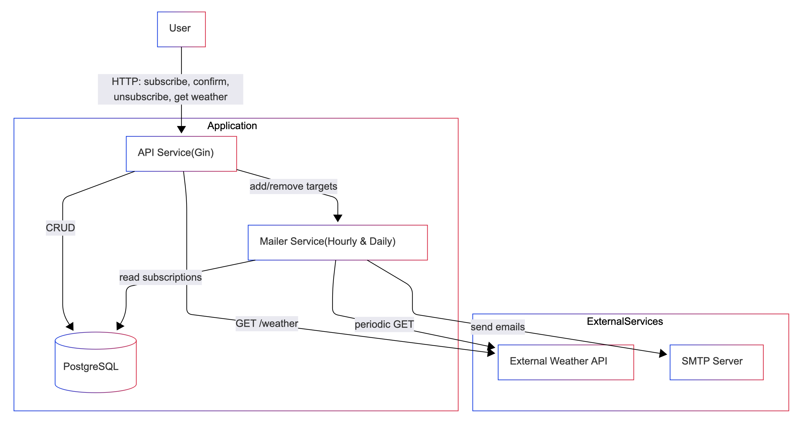
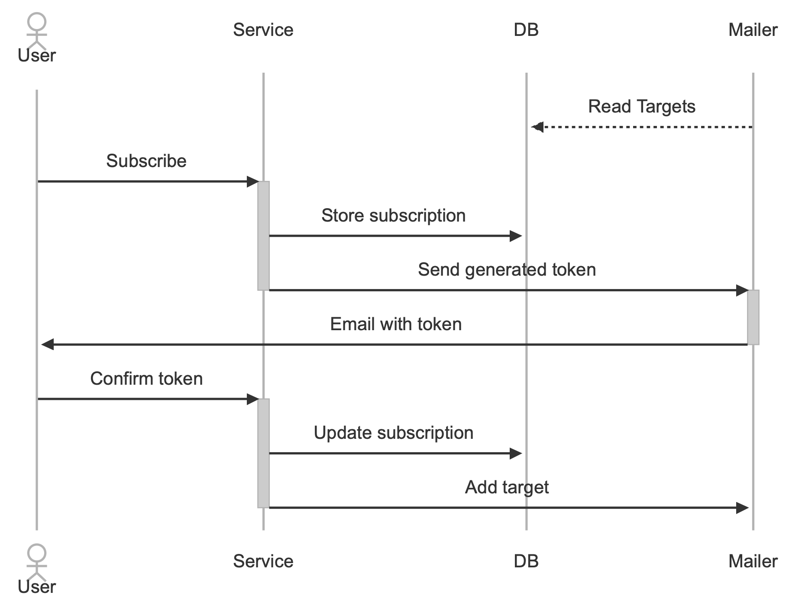
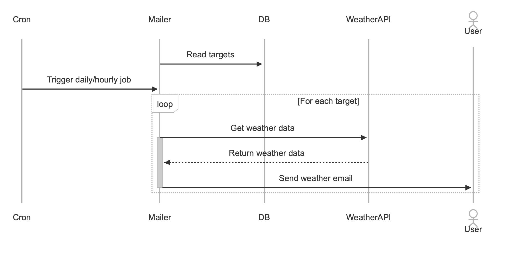
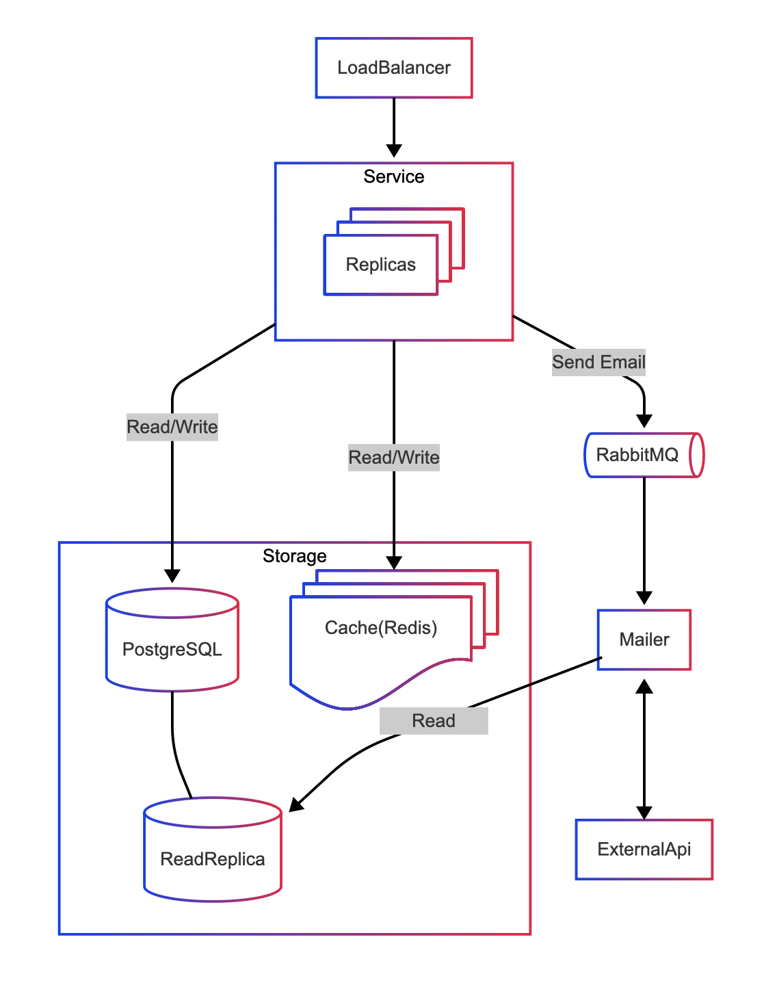

# Design Document

## 1. Considerations

#### 1.1 Assumptions

- We assume that our system would be used as part of Back-end architecture or Standalone service and won't have their own UI or Web interface on it's own.
- We assume that developed system would be used only within Genesis SE School 5.0, but deployment and scalability options should be considered.
- Operational environment consists of Docker and Local environments.
- System would be build using Golang programming language (version 1.24), PostgreSQL database and WeatherAPI (free tier).
- We assume that we are able to use any existing infrastructure components (such as Load Balancer, Proxy, etc.)
- We assume that WeatherAPI rate limits and uptime problems won't be a problem, but proposed design should take them into account.

#### 1.2 Functional Requirements

- User should be able to get current weather forecast for the specified city.
- User should be able to subscribe an email to receive weather updates for a specific city with chosen frequency.
- User should be able to confirms a subscription using the token sent in the confirmation email.
- User should be able to unsubscribe an email from weather updates using the token sent in emails.
- System should send emails with specified frequency (hourly, daily).

#### 1.3 Non-Functions Requirements

- **Availability**: 95.5% uptime.
- **Scalability**: up to 3k users, 30k emails per day.
- **Delay**: <200ms for api requests; <15s for email delivery.
- **Durability**: guaranteed 95.5% of messages delivery.
- **Security**: subscription token is deterministic and irreversible; data validation.

#### 1.4 Constraints

Our system constrained by:
- WeatherAPI (free tier)
  - Calls per month: 1kk
  - Uptime: 95.5%
- Hardware or Cloud Service used for deployment
- Budget
  - 0$

#### 1.5 System Environment

System should be able to be deployed using:
- Cloud solutions (AWS, GCP, Azure)
- Bare Metal (Windows server, Linux server)

## 2. Load Evaluation

#### 2.1 Users and Traffic

- **Active users**: 3k.
- **Subscriptions per user**: 2 (avg.).
- **API requests**: 1000 RPS (peak).
- **Messages**: 30k/day.

#### 2.2 Data

- **Subscription**: ~150 bytes.

#### 2.3 Bandwidth

- **Incoming**: ~2 GB/day.
- **Outgoing**: ~8 GB/day.
- **External API**: ~20 MB/day.

## 3. Architecture

#### 3.1 Overview

The system consists of such components:
1. API Service
2. Mailer Service
3. Database
4. External weather API
5. External SMTP server

#### 3.2 Component Diagrams



**Responsibility**:
- REST requests.
- Data validation.
- CRUD operations.

#### Endpoints
```
GET  /api/weather?city={city}
```
Description: Fetch current weather for the specified city.

```
POST /api/subscribe
```
Description: Create a new subscription and send a confirmation email.

```
GET  /api/confirm/{token}
```
Description: Confirm a pending subscription.

```
GET  /api/unsubscribe/{token}
```
Description: Unsubscribe an email from further updates.

#### 3.4 Sequence Diagrams

_Subscription_


_Mailer_


#### 3.5 DB Schema


## 4. Reliability & Resilience

#### 4.1. Service Level Objectives (SLOs)

SLOs can be accessed [here](./slo.sdd.yaml).

#### 4.2 Scaling

For scaling we propose such approaches.

Horizontal:
- Database
  - Add read replica
  - Add Caching(Redis)
- Service
  - Add Replicas

Decomposition:
- Mailer
  - Move Mailer to a separate service
  - Add Queue (RabbitMQ) for Mailer

#### 4.3 Scaled System Diagram



### 4.4 External Service Fault Tolerance

- If the WeatherAPI endpoint becomes unavailable or returns errors, the Mailer service will pause all notifications.
- Unsent messages are enqueued in message queue (e.g. RabbitMQ/Kafka).
- Once the WeatherAPI resumes normal operation, the queue is drained in FIFO order and delivery is retried automatically.

### 4.5 Message Delivery Guarantees
- We do not guarantee that messages will be delivered in case of SMTP server fault.