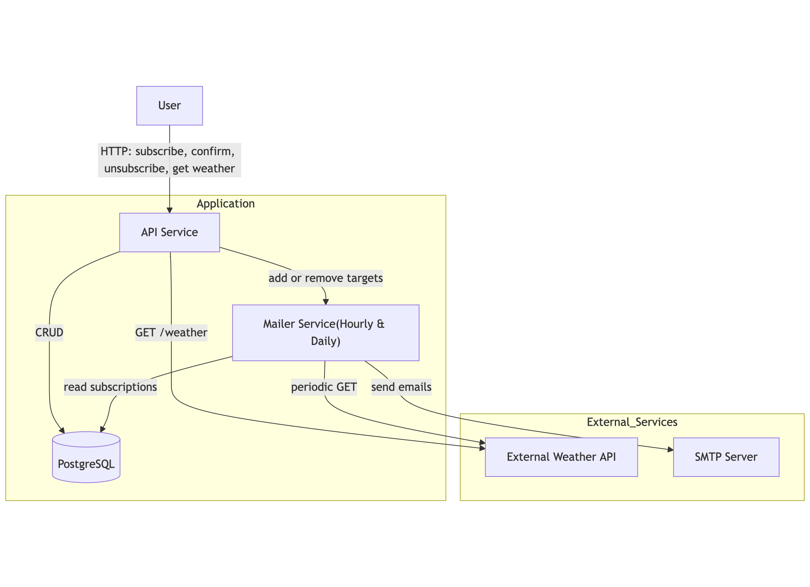

# System Design: Weather Subscription API

## System Requirements

### Functional Requirements
- User should be able to get current weather forecast for the specified city.
- User should be able to subscribe an email to receive weather updates for a specific city with chosen frequency.
- User should be able to confirms a subscription using the token sent in the confirmation email.
- User should be able to unsubscribes an email from weather updates using the token sent in emails.
- System should send emails with specified frequency (hourly, daily).

### Non-Functions Requirements
- **Availability**: 99.9% uptime.
- **Scalability**: up to 1k users, 10k emails per day.
- **Delay**: <200ms for api requests; <15s for email delivery.
- **Durability**: guaranteed messages delivery.
- **Security**: subscription token is deterministic and irreversible; data validation.

### Constraints
- **Budget**: little to no budget.
- **External API rate limits**: 1kk requests per month.

## Load Evaluation

### Users and Traffic
- **Active users**: 500.
- **Subscriptions per user**: 2 (avg.).
- **API requests**: 200 RPS (peak).
- **Messages**: 10k/day.

### Data
- **Subscription**: ~150 bytes.

### Bandwidth
- **Incoming**: 2 GB/day.
- **Outgoing**: 8 GB/day.
- **External API**: 20 MB/day.

## High Level Architecture



## Components Design

### API Service

**Responsibility**:
- REST requests.
- Data validation.
- CRUD operations.

### Endpoints
```
GET  /api/weather?city={city}
```
Description: Fetch current weather for the specified city.

Query parameters:
- city (string, required)

```
POST /api/subscribe
```
Description: Create a new subscription and send a confirmation email.

Request body (JSON):
- email (string, required)
- city (string, required)
- frequency (string, “hourly” or “daily”, required)

```
GET  /api/confirm/{token}
```
Description: Confirm a pending subscription.

Path parameters:
- token (string, required)

```
GET  /api/unsubscribe/{token}
```
Description: Unsubscribe an email from further updates.

Path parameters:
- token (string, required)

### DB Schema
